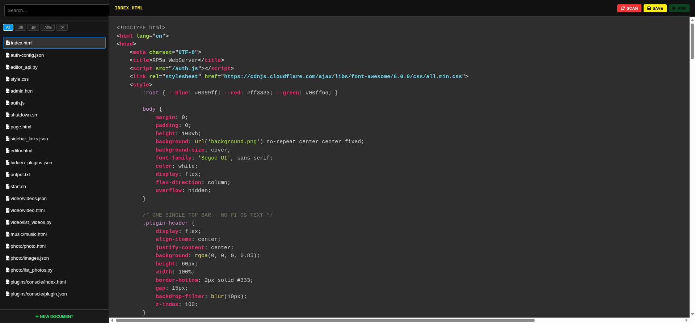
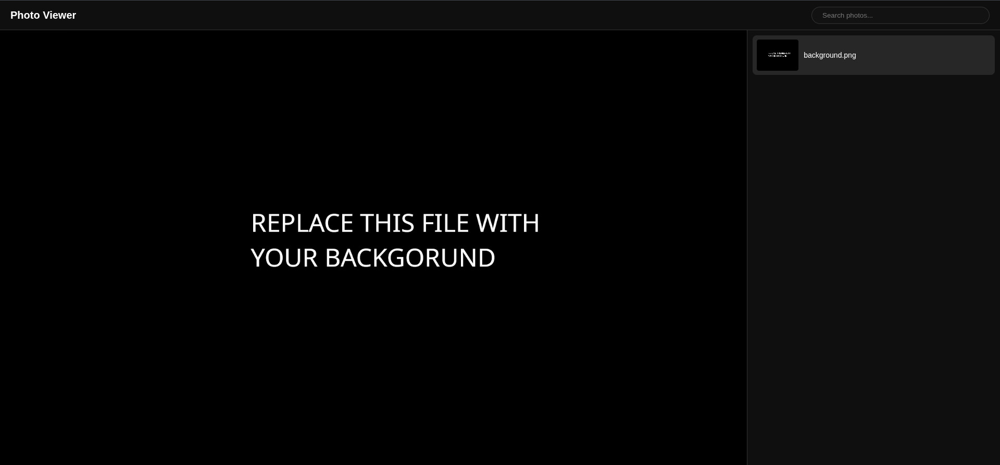
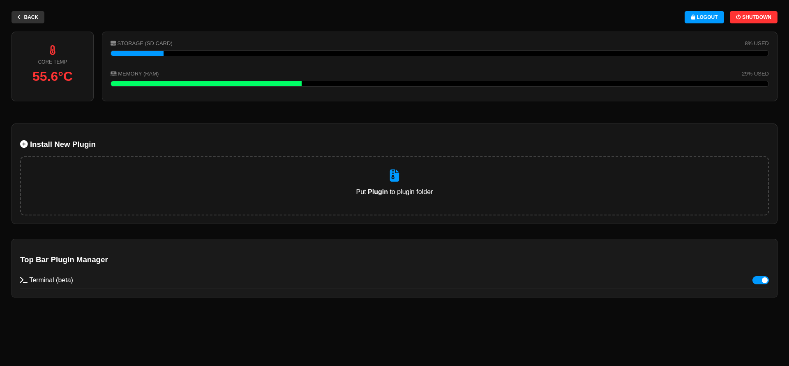
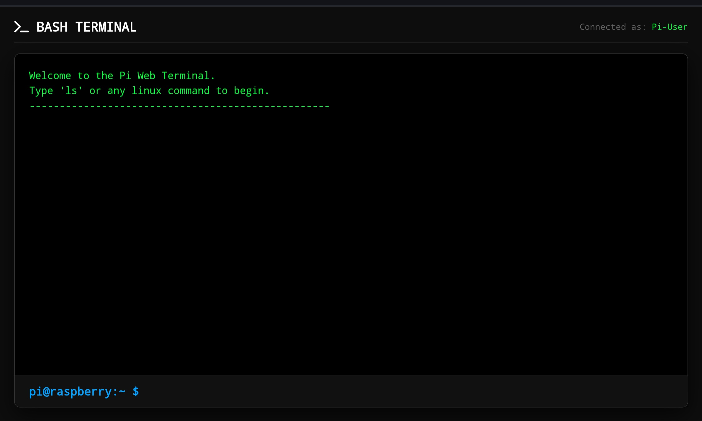

# Rasberry-Pi Light Web Interface
It has a lot of bugs that I want to fix in the future.
The code is very messy. Feel free to download it and change the code.
I tried to comment every change that I did. This is a small web interface with built-in features.
## Main features list:
  - [Editor from HTML, SCRIPTS, PYTHON and JSON](#pi-editor)
  - Admin panel with temperature, storage and memory
  - Music Player
  - Video Player
  - [Photo Viewer](#pi-editor)
  - Plugin manager for installing plugins
  - Home screen

## Other features list:
  - Web Terminal (beta)
  - [Option to host site on local network](#local-site-hosting)
  - [Password lock for UI](#password-lock)

## Main Features Info:
### Pi Editor

You can see all files in **Pi Server GITHUB** folder
Delete and rename button doesn't work at this time, but i want to add them in next updates.
I will also want to add "Upload" button to mkve files directly from your computer to Rasberry Pi
- "RUN" button is to run scripts
- "SCAN" is to scan for new file, but its better to reload page
- "SAVE" is for saving current file
- "New Documnt" is for creating documents
- You can search your files or filter them.

### Photo Viewer

You can see all files in **photo** folder inside **Pi Server GITHUB**.
To search inside your photos press search button. To select image click on it in right sidebar.

### Admin Panel

In admin panel you can see Temperature, Memory, Storage and manage all installed plugins (enable or disable them).
- "BACK" button will go to home screen
- "SHUTDOWN" will stop server and shutdown
- "LOCK" will logout user

## Other features Info:
### Web Terminal (Beta)

You can disable Web Terminal in plugin manager. Web Terminal works but it has one problem. The path to file/folder is alway reseting after every command, so if you want to go to **test** folder and show all files in it you need to run this for an example
| Correct :white_check_mark:| Wrong :x:|
| -------- | ------- |
|`cd test && ls` | `cd test`, `ls`|

### Local site hosting
Open editor and click "New Document" enter name of your document.html. Now you can make your code and then click "SAVE" and exit editor. On main screen press "+" in bottom bar and enter name of your shortcut and path to your site (ex. document.html). Now when you click that shortcut your site will open. You can delete shortcut by clicking trash icon next to your shortcut

### Password Lock
This password is not secure and can be easily bypassed, so don't rely on it. To configure password you need to change <br> **auth-config.json** in editor: <br>
```
{
  "auth_enabled": false,
  "password": "secret"
}
```

## Install plugins
To install plugin put unzipped folder with your plugin to **Plugins** folder. To unnistal plugin delete your folder with plugin inside **Plugins** folder. To enable or disable plugin, open Admin Panel, scroll down to plugin manager and disable or enable selected plugin using toggle button

## Instalation guide
### 1. Clone this repository
Open this [link](https://github.com/K3Soft-Hard/Rasberry-Pi---Light-Web-Interface/archive/refs/heads/main.zip) or use `git clone https://github.com/K3Soft-Hard/Rasberry-Pi---Light-Web-Interface`
### 2. Unzip it
If this repository is zipped after download, then unzip it

### 3. Go to folder **Pi Server GITHUB**

### 4. Make sure you have installed python
If you don't already installed python, then download it


### 5. It's recomended to run `chmod +x *` <br>
### 6. Run server <br>
Use `./start.sh` or just double click it in File Explorer and press "Execute in Terminal"
### 7. Setup everything how you want and you can even change the code if you want
